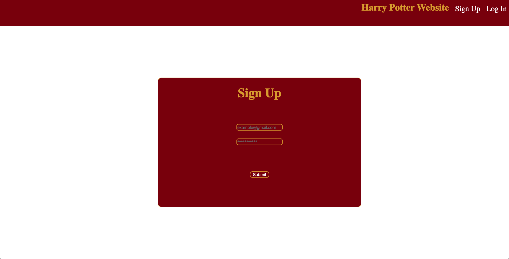
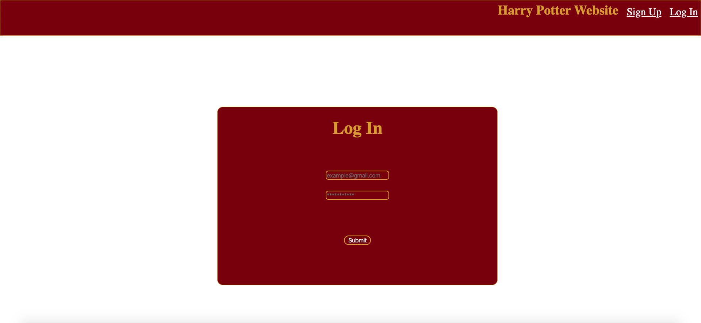
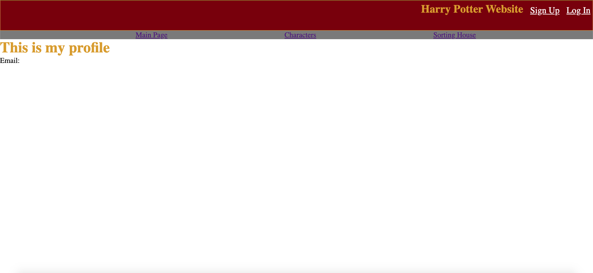
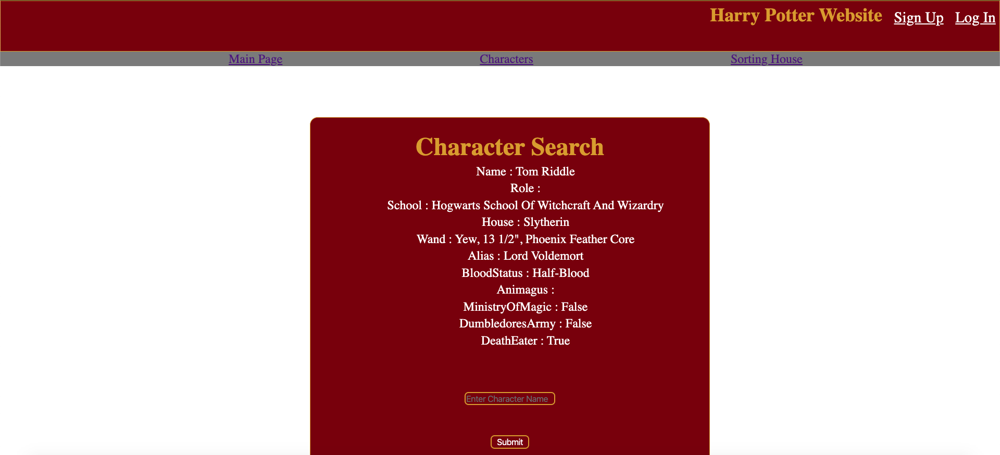
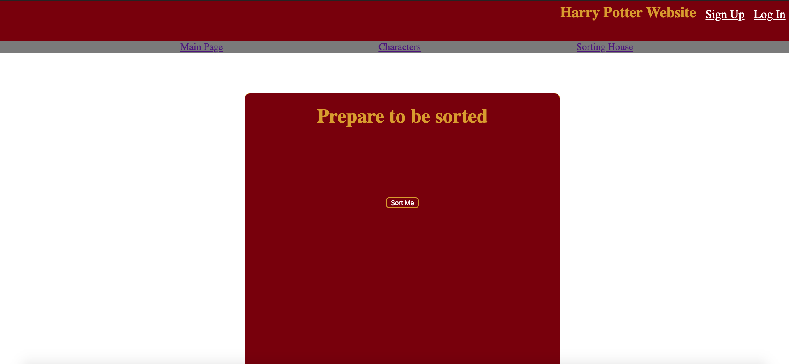
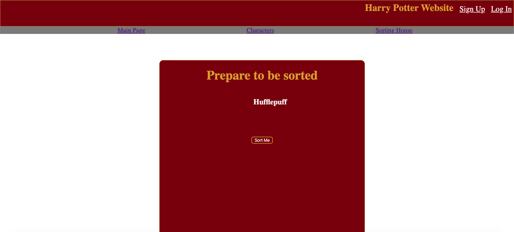

# This is my full stack project 
in this project i have used:
- JavaScript
- Express 
- Express-Handlebars 
- mongoDB (noSQL database)
- mongoose 
- sessions

## What my site does
To access the site you have to sign up then log in, i achieved this feature by using sessions to make sure the user has an active session before allowing them to access the page.
When logged in, the user has two features to choose from- they can either request data on a harry potter character or be sorted into a hogwarts house...
Both of these features use API data to return what the user requests.
On the characters page you can search by name or by character alias.

## How the log in works
When the user inputs their email and password- we check the users database for an email that matches their input then if the passwords match aswell, their session begins and they are grante access to the website.

# How to use the website...
1. If you have already signed up, please skip to point 3...
When you load the page you will be directed to the sign up page, you will need to input your active email address into the 'email box', then write the password you wish to use into the 'password' box.

2. Submit your sign up request by clicking the sign up box beneath the email and password input fields. Then you will be redirected to the log in page.
3. Enter your email and password into their repective fields on the page then click the submit button. If your email and password match the ones in our database then you will recieve access to the site.Else, you will be asked to try again.

4. At this stage you will have full access to the site, to navigate between the sites features use the navigation bar. if you wish to know how to use the characters page refer to 6 and if you wish to use the sorting hat page refer to 7.
5. You will currently be on the home page of the website.

6. To affectivly use the characters page- this page will return details on any character in the harry potter universe. All you have to do is specify whitch character you would like infomation on. To do this you will need to write either the characters full name (Tom Riddle) or alias name (Lord Voldemort) into the input box and press submit. this should return all the available information on this character. 

7. To affectivley use the sorting house page- this page will randomly sort you into a hogwarts house. To do this you need to click the button labeld 'Sort me' and the page will return your new house!

### Have fun using the site :)